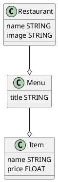

# Bootcamp > Week 2 > Day 1

## Overview of the day

Today introduces data modeling and UML entity diagrams. Apprentices will also be practicing writing tests which gives them a chance to consolidate their learning.

# Session 1 - UML

## Learning Objectives

* Create a UML data model diagram
* Use 'has many' and 'belongs to' to correctly label relationship between classes

## Pre-work or Assumed knowledge

* should have completed the Airports exercise
* should have set up Jest unit tests

## Materials

* https://planttext.com for UML diagrams || install the plantuml plugin for VSCode

## Notes

This session starts by repeating the ideas from week 1. You can get them into breakout rooms and have them jam board with sticky notes all the objects that might be in a restaurant app. Look for 'Restaurant', 'Menu' and 'Dish' or 'Item'.

Have them report back, you can identify how hard it is to communicate their data model of a restaurant verbally. It is really too complex to discribe with words, here we need a diagram or a drawing to make it easier to follow.... 

Which brings us to UML. Have them set this up in their editors. Its worth spending the time on it as we want them able to create diagrams now and throughout their apprenticeship, in their portfolios, and synoptic project.

As a back up you can use the site: [https://planttext.com](https://planttext.com) which requires no install.

Easy install on OSX `brew install plantuml`. On windows there are instructions on the site, you need Java and GraphViz installed. This is also a good resource [PlantUMLHitchhikersGuide](https://crashedmind.github.io/PlantUMLHitchhikersGuide/index.html).

Walk everyone through an entity diagram.

## Assignment

Get your apprentices to send you their diagrams.

## Additional Reading

* [PlantUMLHitchhikersGuide](https://crashedmind.github.io/PlantUMLHitchhikersGuide/index.html)

# Session 2 - Implement your model

## Learning Objectives

* Demonstrate knowledge of unit tests
* Demonstrate knowledge of classes

## Pre-work or Assumed knowledge

* To have written unit tests in Jest

## Materials

* UML data model diagram

## Notes

The apprentices should have their diagram. They can now implement this data model. Expect to see them working TTD to have a data model that is fully tested. Introduce Jest's coverage tool. You might talk about creating some seed data.

## Assignment

Make some time to review this assignment. Get the apprentices to create a repo and add their UML diagram to it. Screenshot the UML diagram or export it. Drag the image into a github issue (in their repo). They can then use the URL in their README.md file and display the diagram on the repo landing page - very professional.

## Additional Reading