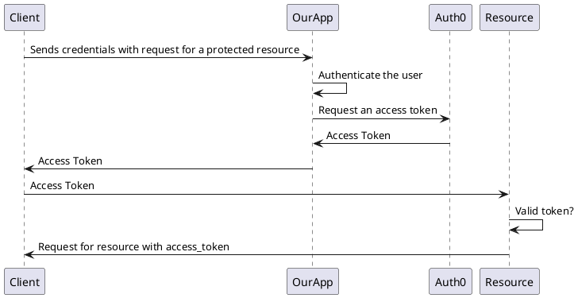

# Mod 1 > Week 2 > Day 2

## Overview of the day

Sessions and the OAuth flow

# Session 1 - Sessions

## Learning Objectives

* Implement sessions in express
* Demonstrate session based user auth

## Pre-work or Assumed knowledge

* A basic express app has been built with a `User` model

## Materials

## Notes

### State & Sessions

* Make a class that returns a numeric value after each request i.e. 1,2,3,4,5,6
* Expose this in a GET endpoint and return those values
* Have the state in the route - always returns 1
* Have the state on the server - increments, but out of sequence
* Add sessions 
* Have the counter in a session - perfect individual client based incrementalism

```javascript
class Counter {
    constructor() {
        this.value = 0
    }

    inc() {
        this.value += 1
        return this.value.toString()
    }
}
```

```javascript
app.get('/counter', (req, res) => {
    const counter = new Counter()
    res.send(counter.inc())
})
```

Remember the above will only ever return 1.
Next pull the counter into a server level instance:

```javascript
// top of file before routes
const counter = new Counter()

app.get('/counter', (req, res) => {
    res.send(counter.inc())
})
```

To add sessions `npm i express-session` then use the following config:

```javascript
const sessionSettings = {
    secret: "best cohort ever or some other secret phrase",
    resave: false,
    saveUninitialized: true
}
```

Update your Counter class to keep track of every instance (use a static property).

```javascript
class Counter {
    static lookup = {}
    
    constructor(id) {
        this.value = 1
        Counter.lookup[id] = this
    }

    inc() {
        this.value += 1
        return this.value.toString()
    }
}
```

Add a middleware function that will run on every request this makes sure new requests have an instance of the counter they can access with their session id:

```javascript
app.use((req, res, next) => {
    Counter.lookup[req.session.id] = Counter.lookup[req.session.id] || new Counter(req.session.id)
    next()
})
```

finally in the route return the next value

```javascript
app.get('/counter', (req, res) => {
    res.send(Counter.lookup[req.session.id].inc())
})
```

You'll have to use the session id. If you try to add the instance of a Counter to `req.session.counter = new Counter()` it will get stringified and stop working. So thats why you are having to use the session id to lookup the instance of a clients counter.

## Assignment

In the morning session get your apprentices to implement sessions so they can log in and log out.

They need to change there code and add.

1. `/login`
2. `/logout`

In the login controller they should auth the client as before, if they are a valid client (the passwords match) then add the user id to the session `req.session.userId = user.id`. To log out all they need to do is `req.session.userId = null`.

To protect a route like `/users/:id` use a middle ware that checks for `req.session.userId` and finds the user. Remember you can add that user to `res.locals.user = user` and call `next()`.

Now that is session based auth. We are just passing the _username:password_ once.

## Additional Reading

[Session Recording](https://zoom.us/rec/share/_2sh4nCLpZmFLF0qCorjgROpxf8JsFGgKmrXpPraJDk1I6U9bdMq4CjyBhWaJhik.6Z7PNWM0o9PTk3c7) _Start Time : Jan 26, 2021 10:17 AM_

----

# Session 2 - The OAuth Dance

## Learning Objectives

* Create a UML sequence diagram
* Encode and Decode JWT tokens
* Recall the structure of a JWT

## Pre-work or Assumed knowledge

## Materials

## Notes

This session is laying the foundations for understanding and keeping track of OAuth flow. It is also an important time to practice UML diagrams (a competency of the Level 4 standard). Explain the OAuth sequence. Make a UML diagram:

## Assignment




## Additional Reading

[Session Recording](https://zoom.us/rec/share/Ul8R1t2y_7mjvvyn5nHvuWu5fevLANO2BKM4Aq3DRrDhWuDZssiOlHGetVsnq5Zf.PGHLvdyBBzk5QyxT?startTime=1611669639000) _First minute is waiting music skip to 1:04_