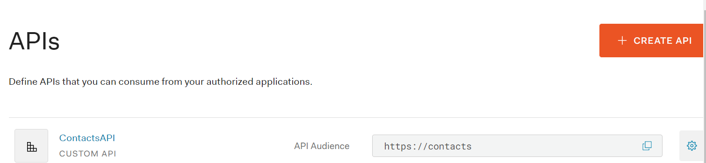

# Mod 1 > Week 2 > Day 3

## Overview of the day
Today we are going to learn about how to use OAuth to secure our API. 

## Learning Objectives
* Understand JWT tokens
* Understand the OAuth flow
* Understanding the advantages of OAuth over Basic Auth
* Implement OAuth using Auth0 https://auth0.com/docs/quickstart/backend/nodejs/01-authorization#configure-auth0-apis and https://auth0.com/docs/flows/authorization-code-flow

## Before we start

## Materials needed

# Lesson 1
## What's wrong with Basic Auth?
  * The password is sent over the wire in base64 encoding which can be easily decoded
  * The password is sent repeatedly i.e. on each request meaning there is a large attack window
  * The password is cached by the webbrowser, therefore it could be silently reused by any other request to the server e.g. CSRF
  * The password may be stored permanently in the browser, if the user requests. (Same as previous point, in addition might be stolen by another user on a shared machine).

## What is OAuth?
OAuth (2.0) is an open standard for authorization. It controls authorization to a protected resource such as an API.

If you’ve ever signed up to a new application and agreed to let it access your Facebook or phone contacts, then you’ve used OAuth. OAuth provides secure delegated access which means an application can access resources from a server on behalf of the user, without them having to share their credentials. It does this by allowing an Identity Provider (we will be using Auth0) to issue access tokens. The token informs the API that the bearer of the token is authorized to access the API.

### What makes OAuth secure?
  * Token management means we can track each device that uses the API (and revoke access if we want)
  * OAuth provides 'scopes' which allow for fine-grained authorization 
  * Token expire, making it very hard for them to be reused

Let's look at this diagram which illustrates the OAuth flow we are going to be using today (client credentials flow):


TODO - add more explanation and diagrams.


# Lesson 2
COACHES - clone https://github.com/WhiteHatLearningProducts/swe-solutions/tree/main/mod1/contacts-api/basicAuthSecured/js (TODO - add a template for students) and follow the steps in the REAME.md file.

STUDENTS - open the Contacts API you created yesterday in Visual Code.  This is currently secured using Basic Auth and we are going to modify it to be secured instead by OAuth.

Check you can call the API ok using Postman using `GET http://localhost:3000/contacts/me` and passing an Authorization header.

## Javascript developers
1. Install the following node package dependencies:
`npm install cors dotenv express-jwt jwts-rsa`

2. Remove the dependency to `express-basic-auth` 

3. Modify the start of your `app.js` file as follows
```javascript
const express = require("express");
const jwt = require('express-jwt');
const jwksRsa = require('jwks-rsa');
const db = require('./database.js');
const cors = require('cors'); // may not be required

require('dotenv').config('.env'); // Note: env vars should not be used in production

// initialise Express
const app = express();

app.use(cors());

// ...
```
4. Create a `.env` file and add the following entries (substituting in your personal Auth0 domain):

`AUTH0_AUDIENCE=https://contacts`

`AUTH0_DOMAIN=[your domain].eu.auth0.com`

5. Add a function to check for a valid OAuth (JWT) token:
```javascript
// create middleware for checking the JWT
const checkJwt = jwt({
  secret: jwksRsa.expressJwtSecret({
    cache: true,
    rateLimit: true,
    jwksRequestsPerMinute: 5,
    jwksUri: `https://${process.env.AUTH0_DOMAIN}.well-known/jwks.json`
  }),
  audience: process.env.AUTH0_AUDIENCE,
  issuer: `https://${process.env.AUTH0_DOMAIN}`,
  algorithms: ['RS256']
});

```
6. Secure your API:
```javascript
app.get("/contacts/me", checkJwt, (req, res) => {
```

That's it!

Now try to call your API using Postman - you should see a 401 Unauthorized response.

This is because we have not configured our API as an OAuth resource and we are not sending an OAuth token.

Let's move onto Lesson 2 and try to fix this!

# Lesson 3
Sign up to Auth0, a service which implements OAuth and is used by many well known companies including M&S to secure their Web APIs.
  * Go to https://auth0.com/signup 
  * Use your personal email account, select your region as Europe and opt out of notifications. Ensure you create a PERSONAL account type.

Auth0 is commercial solution for adding authentication and authorization services to your applications. There are many [use cases](https://auth0.com/docs/get-started#use-cases-for-auth0) for using Auth0 but we are going to focus on using it to secure our API with OAuth.

Navigate to your Dashboard and select to `Create API` using the naming as below 

Now navigate to the `Test` tab of your new API. You will see that no applications are authorised to access the API hence we can't test it. Click on the `Create & Authorise Test Application` link. This should create a new `ContactsAPI(Test Application)` under the `Applications` menu.

You will see a section called `Asking Auth0 for tokens from my application`. Use the information from the cURL request to help you construct a Postman request to obtain a new OAuth token.

Let's break the request in more detail:
| Element | Explanation |
| ------- | ----------- |
| audience | represents the resource which we are trying to access |
| grant_type | we are using `client_credentials` OAuth flow as we are making a machine -> machine connection hence schemes like username + password or social logins don't make sense. You can read more about this flow [here](https://auth0.com/docs/flows/client-credentials-flow). If you are creating an SPA you should use the [Authorization Code Flow with Proof Key for Code Exchange (PKCE)](https://auth0.com/docs/flows/authorization-code-flow-with-proof-key-for-code-exchange-pkce) instead (we will cover this later).
| client_id | this is the id of the ContactsAPI(Test Application) we created earlier - rememeber we authorised it to be able to access the ContactsAPI. |
| client_secret | this is the client secret of the ContactsAPI(Test Application) we created earlier - rememeber we authorised it to be able to access the ContactsAPI. |

You should see a 200 success status and the body of the response should contain an `access_token`. Paste it into the Debugger at https://jwt.io and explore the contents...

Great! Now we can try calling our API with this token, copy it and paste it as a `Bearer Token`. Hopefully you should see a 200 OK response!


TODO - create an SPA to call the API..

Useful doc - https://auth0.com/docs/architecture-scenarios/spa-api

[next](/swe/mod1/wk2/day4.html)
[main](/swe)